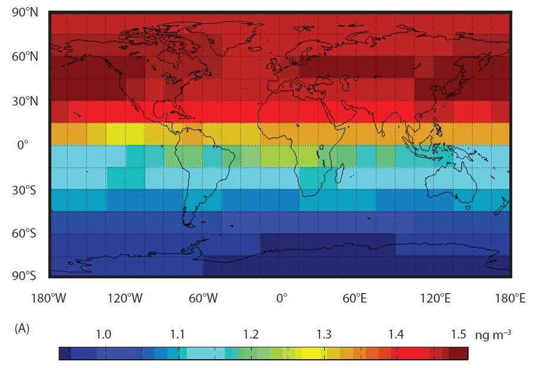
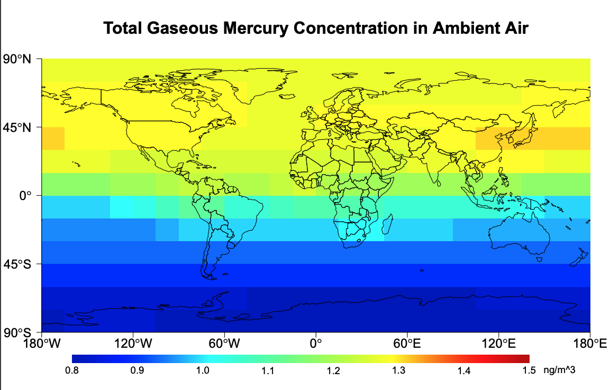
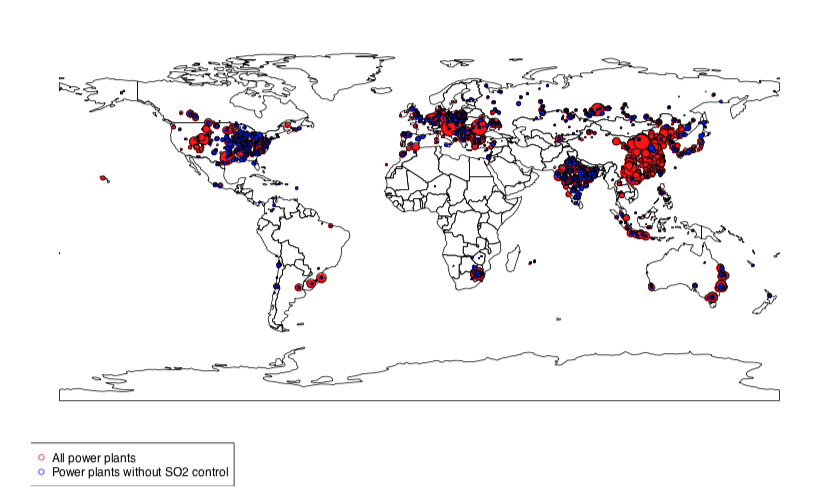
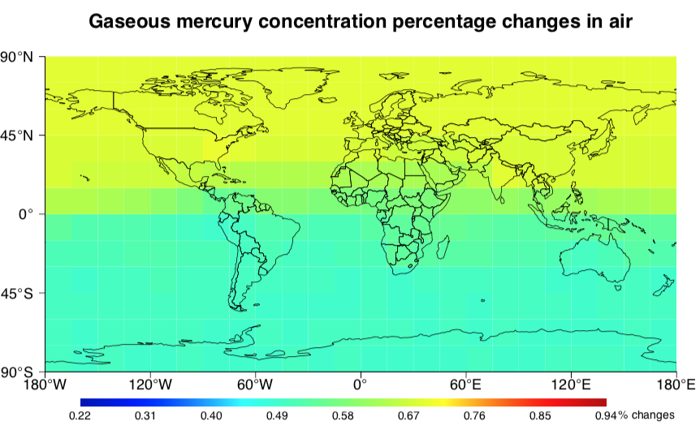
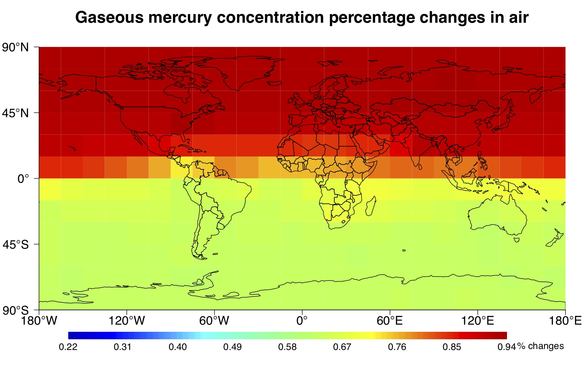

# Master_project_work_showcase

 This repo is a small show case of my master project work using R and MATLAB. The most exciting part of this project that I want to discuss is data visualization technique I used. In this post, I will first introduce the background of this study, and then mainly discuss the results of my modelling and calculation work.

## Background information

Global warming is a well-sound alarm occupying the news everyday, before the corona hit us. The most relatable source of pollution or contribution for an average joe might be the black smoke comming out of the chimney from nearby power plant. Indeed, coal-fired power plant is one of the main contributor to emission of green house gases, but what is little know to many people is, it's not only green house gases being emitted by power plant. Sometimes it also contains heavy metal pollutants,for example, mercury. 

But from all the emission happened from global power plants, how much mercury emission happened every year? After they are emitted, how would they distribute globally? While, if it's really bad, what can we do to reduce it? How well the effect of reduction be? 

There has been some studies investigating in this question, but it's still rather new. My thesis project was then focusing on answering those questions by 1) modelling the mercury emission 2) Calculating the mercury gaseous concentration distribution globally, 3) Purpose the mitigation strategy and model the effect after the mitigation strategy.

### What is given?

Before starting the work, I used an existing model, developed by the lab that I worked for, to calculate global mercury emission. Another model which is co-developed in the lab for calculating gaseous mercury concentration distribution is used to calculate the global mercury concentration distribution. 

## Result of the study 

### Graphic comparison of mercury emission scenario

This graphs shows what would mercury concentration in the air be if the emission we have is like in year 2000.

This graph shows, the scenario where some technologies are adapted to reduce the emission in 2010 and what would the mercury concentration in the air be in 2060.

### Distribution of global power plants

### Global mercury concentration change after upgrading

To reduce the mercury emission and resulting concentration in the air, two different methods are purposed to apply technology upgrade to a selection of power plants. The following graph display the results of this technology upgrade.

Both graphfs display the percentage decrease of mercury concentration in the air. 

The effect of using A technology

The effect of using B technology

