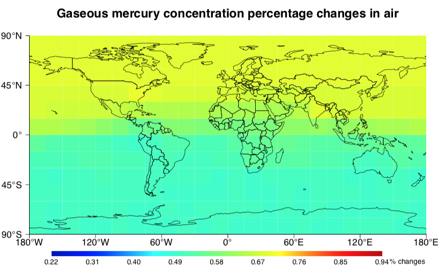

# Master_project_work_showcase

 This repo is a small show case of my master project work @ETH Zurich, using R and MATLAB. The most exciting part of this project that I want to discuss is data visualization technique I used. In this post, I will first introduce the background of this study, the aim of the study, and then mainly discuss the results of my modelling and calculation work.

## Background information

Global warming is a well-sound alarm occupying the news everyday, before the corona hit us. The most relatable source of pollution or contribution for an average joe might be the black smoke comming out of the chimney from nearby power plant. Indeed, coal-fired power plant is one of the main contributor to emission of green house gases, but what is little know to many people is, it's not only green house gases being emitted by power plant. Sometimes it also contains heavy metal pollutants,for example, mercury. 

But from all the emission happened from global power plants, how much mercury emission happened every year? After they are emitted, how would they distribute globally? While, if it's really bad, what can we do to reduce it? How well the effect of reduction be? 

There has been some studies investigating in this question, but it's still rather new. My thesis project was then focusing on answering those questions by 1) modelling the mercury emission 2) Calculating the mercury gaseous concentration distribution globally, 3) Purpose the mitigation strategy and model the effect after the mitigation strategy.

### What is given?

Before starting the work, I used an existing model, developed by the lab that I worked for, to calculate global mercury emission. Another model which is co-developed in the lab for calculating gaseous mercury concentration distribution is used to calculate the global mercury concentration distribution. 

### Goal
1. Model the mercury emission scenario.
    1. An emission calculation model was developed by Ecosystem Design Lab. I use this to calculate global mercury emission.
    2. **Comparison by visualisation** : I needed to reproduce a similar visualisation in R and compare it to original visualisation, without knowing what program or how the visualisation was generated in the reference.
2. Propose mitigation strategy to reduce mercury pollution:
    1. Propose strategy on a global scale to reduce global mercury emission and concentraiton.
    2. **Compare the result by visualisation**
3. **Study the effect of mitigation strategy on a local scale**
    
## Result of the study 

1. Compare the produced visualisation with reference.
2. Present the global and local change with the same visualisation scale.
3. Discuss the pro and cons of visual comparison

### 1. Compare the reproduced visualization of data and graph

Plot from reference: 

Plot from me:

The original plot is probabaly generated in MATLAB. I used R to best mimic the visualisation to help me compare 
how good is our computation method, compared to the reference.

From the general color representation, it could be seen that my visualisation was very close to the original one.
Keep in mind that the computation method is also different. So it will result in actual different value in some cells.

### 2.1  Global change of mercury concentration after mitigation

This graphs shows what would mercury concentration in the air be if the emission we have is like in year 2000.

This graph shows, the scenario where some technologies are adapted to reduce the emission in 2010 and what would the mercury concentration in the air be in 2060.

#### Distribution of global power plants

### 2.2 Global mercury concentration change after upgrading

To reduce the mercury emission and resulting concentration in the air, two different methods are purposed to apply technology upgrade to a selection of power plants. The following graph display the results of this technology upgrade.

Both graphfs display the percentage decrease of mercury concentration in the air. 

The effect of using A technology

The effect of using B technology

### 3. Discussion of visualisation method

In this project, I mainly implemented the visualization scheme presented above. The aim is to compare the changes directly with the "same" color scale and unit in each graph. Since the original color scale was not clearly presented in the reference (see the first graph), I had to emulate the color scale as close as possible using R package. The advantage of using the same color scale is :
1. Two graphs can be compared together directly. The numerical change is linearly mapped to color change.
2. The consistency through out the project makes it easier to understand the changes in each scenario.

The disadvantages are:
1. The color scale used here is not necesarily color blind friendly. 
2. Although the numerical changes are mapped to color changes, sometimes its not strong enough to produce or spot a color change.

What's your opinion? 
